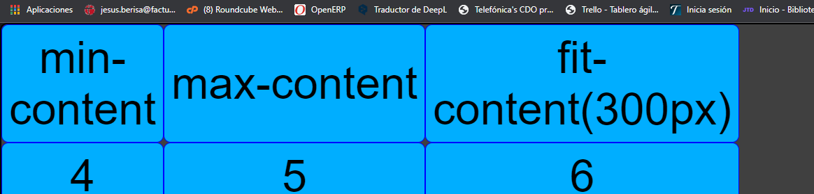

# Apuntes GridCSS

## Basico

`display:grid`

Grid con el ancho 100%

`display:inline-grid`

Grid pero con el ancho definido por el contenido

## grid-template-columns/grid-template-rows

Define las columnas/lineas del grid

Propiedades:

- min-content -> El tamaño sera el de la palabra mas ancha del texto
- max-content -> Estirar el contenido para que no haga salto de linea
- fit-content -> Como minimo usara el min-content y puede crecer hasta el numero que le he introducido o hasta que llegue a su max-content

> fit-content\
> Si por ejemplo pongo fit-content(40000px) la caja crecera hasta el max-content del contenido y como minimo se aplicara el min-content del contenido

- auto\
  Ancho automatico (Espacio restante)

- fracciones (fr)\
  Podemos definir cuanto espacio le damos a cada caja del total que hay/
  > En este ejemplo lo que estoy haciendo es que la primera caja sea de 100px la segunda y la tercera tenga el espacio restante dividido entre 2

- minmax\
  Le digo que tamaño minimo y maximo puede tener la caja.

  > `grid-template-columns: minmax(200px, 1fr) 1fr 1fr`\
  > Minimo 200px, maximo 1fr

- repeat\
  Para no escribir tanto.

  > `grid-template-columns: 1fr 1fr 1fr;` === `grid-template-columns: repeat(3, 1fr)`

- auto-fit\
  Sirve para hacer responsible las cajas.

  > `grid-template-columns: repeat(auto-fit, minmax(400px, 1fr))`\
  > Lo que le estoy diciendo aqui es que haga las columnas con un minimo de 400px y si hay hueco que meta otra mas

- auto-fill\
  Sirve para hacer responsible las cajas.
  > `grid-template-columns: repeat(auto-fit, minmax(400px, 1fr))`\
  > La diferencia con la anterior es que si hay hueco en vez de usar todo el espacio creara cajas invisibles para rellenar el espacio

## grid-auto-rows/grid-auto-columns

Todas las rows o columns tienen el tamaño X.\
`grid-auto-rows: 50px;` -> Quiere decir que todas las rows tienen un tamaño de 50px.

## grid-auto-flow

Direccion a donde tienen que ir los elementos.\
`grid-auto-flow: row;` -> el grid tiene direccion row

## row-gap, column-gap, gap

Separacion entre columnas/ filas

## align-items, justify-items, align-content, place-items

Algo importante es el **stretch** que sirve para que el contenido pill todo el espacio disponible.

## Extras

- extra
  

- dense\
  Si se quedan huecos vacios el dense sirve para rellenarlos

- extra
  
